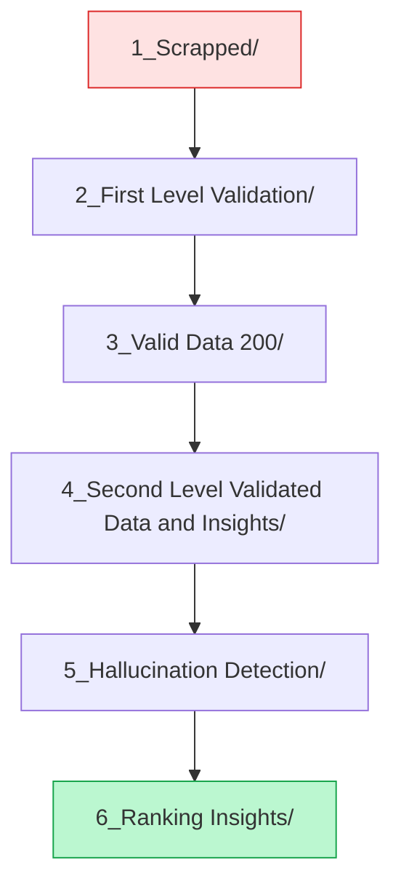

# Dataset Processing Pipeline

This directory contains the complete data processing pipeline from raw scraped articles to final ranked insights.

## Pipeline Stages

## Stage Descriptions

| Stage | Directory | Description |
|-------|-----------|-------------|
| 1 | `1_Scrapped/` | Raw sports articles scraped from online sources |
| 2 | `2_First Level Validation/` | Initial filtering for language and relevance |
| 3 | `3_Valid Data 200/` | Validated articles meeting quality threshold |
| 4 | `4_Second Level Validated Data and Insights/` | LLM-generated insights from validated articles |
| 5 | `5_Hallucination Detection/` | Fact-checked insights (GPT-4o / SummaCConv) |
| 6 | `6_Ranking Insights/` | Final insights with importance rankings |

## Output

The final output from Stage 6 is converted to JSONL format and stored in [`../Dataset_jsonl/`](../Dataset_jsonl/) for model training.

## Related Scripts

Processing is performed by scripts in [`../../data_generation/`](../../data_generation/):
- `article_validation_save.py` → Stages 2-3
- `insight_generation.py` → Stage 4
- `factScore.py` / `summacConv.py` → Stage 5
