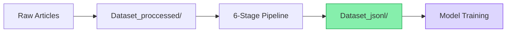

# Dataset

This directory contains all data resources for the SUMMIR framework, organized into two main subdirectories.

## Structure

```
Dataset/
├── Dataset_jsonl/        # Final curated JSONL datasets for training/evaluation
└── Dataset_proccessed/   # Raw → processed data pipeline (6 stages)
```

## Subdirectories

| Directory | Purpose | Documentation |
|-----------|---------|---------------|
| [`Dataset_jsonl/`](Dataset_jsonl/) | Sport-specific JSONL files ready for model training | [README](Dataset_jsonl/README.md) |
| [`Dataset_proccessed/`](Dataset_proccessed/) | Complete data processing pipeline from scraping to ranking | [README](Dataset_proccessed/README.md) |

## Data Flow



## Related Documentation

- See [`dataset_details.pdf`](../dataset_details.pdf) for comprehensive methodology
