# Sports Insight Ranking

> 📄 **Paper**: [SUMMIR: Sentence Unified Multimetric Model for Importance Ranking](https://drive.google.com/file/d/1u_ACndtHPhG4wrcnZQVX6PbbCJKhitro/edit) *(Preprint)*

This project provides a complete framework for ranking sports-related sentences based on their importance and relevance. The system leverages large language models (LLMs) to generate insights from sports articles and then uses custom-trained reward models to rank these insights. The project is structured to handle everything from data preparation to model training and evaluation.

Additionally we introduce a novel architecture **SUMMIR: Sentence Unified Multimetric Model for Importance Ranking** designed to rank these insights according to user-specific interests. These rankings are further tested and verified against gold standard rankings.

## Table of Contents

- [Project Overview](#project-overview)
- [Directory Structure](#directory-structure)
- [Workflow](#workflow)
  - [1. Data Generation](#1-data-generation)
  - [2. Model Training](#2-model-training)
  - [3. Evaluation](#3-evaluation)
- [How to Run](#how-to-run)
  - [Prerequisites](#prerequisites)
  - [Running the Pipeline](#running-the-pipeline)
- [Models](#models)
  - [Data Generation Models](#data-generation-models)
  - [Ranking Models](#ranking-models)
- [Supplementary Files](#supplementary-files)

## Project Overview

The goal of this project is to automatically rank sentences from sports articles to highlight the most important information. This is achieved through a multi-stage process:

1.  **Data Collection and Validation**: Sports articles are collected and validated to ensure they are relevant to specific games.
2.  **Insight Generation**: An LLM is used to generate key insights from the validated articles.
3.  **Factual Scoring**: The generated insights are scored for factual consistency against the original articles.
4.  **Model Training**: Reward models (Llama 3.2 1B and 3B) are trained using Proximal Policy Optimization (PPO) to rank the insights. The models are optimized for either NDCG or Recall.
5.  **Evaluation**: The performance of the ranking models is evaluated using NDCG and Recall metrics.

## Repository Structure

```mermaid
graph TD
    subgraph Root ["📁 Sports Insight Ranking"]
        ROOT["SUMMIR"]
        
        ROOT --> DS["📊 Dataset/"]
        ROOT --> DG["⚙️ data_generation/"]
        ROOT --> TC["🧠 training_code/"]
        ROOT --> EC["📈 evaluation_code/"]
        ROOT --> SF["📋 supplementary_files/"]
        ROOT --> DOCS["📄 Documentation"]
        
        DS --> CRICKET["Cricket (ODI, T20)/"]
        DS --> MLB["MLB/"]
        DS --> NBA["NBA/"]
        DS --> SOCCER["Soccer/"]
        
        DG --> PROMPTS["prompt_for_each_sport/"]
        DG --> DG_CODE["🐍 Codes: Data Generation"]
        
        TC --> IMAGES["images_while_training/"]
        TC --> TC_CODE["🐍 Codes: Model Training"]
        
        EC --> EC_CODE["🐍 Codes: Evaluation"]
        
        SF --> SF_CODE["🐍 Codes: Data Processing"]
        SF --> SF_DATA["📋 Lexicon CSVs"]
        
        DOCS --> PDF1["Supplementary_Appendix.pdf"]
        DOCS --> PDF2["dataset_details.pdf"]
        DOCS --> CSV["response_human.csv"]
    end
    
    click DS "Dataset/README.md"
    click DG "data_generation/README.md"
    click TC "training_code/README.md"
    click EC "evaluation_code/README.md"
    click SF "supplementary_files/README.md"
    
    style ROOT fill:#1a202c,stroke:#4a5568,color:#fff
    style DS fill:#48bb78,stroke:#276749,color:#fff
    style DG fill:#ed8936,stroke:#c05621,color:#fff
    style TC fill:#9f7aea,stroke:#6b46c1,color:#fff
    style EC fill:#f56565,stroke:#c53030,color:#fff
    style SF fill:#4299e1,stroke:#2b6cb0,color:#fff
    style DOCS fill:#718096,stroke:#4a5568,color:#fff
    style DG_CODE fill:#fed7aa,stroke:#ea580c,color:#000
    style TC_CODE fill:#ddd6fe,stroke:#7c3aed,color:#000
    style EC_CODE fill:#fecaca,stroke:#dc2626,color:#000
    style SF_CODE fill:#bfdbfe,stroke:#2563eb,color:#000
    style SF_DATA fill:#a5f3fc,stroke:#0891b2,color:#000
```



## Quick Navigation

| Directory | Purpose | Documentation |
|-----------|---------|---------------|
| [`Dataset/`](Dataset/) | Sport-specific training datasets | [README](Dataset/README.md) |
| [`data_generation/`](data_generation/) | Insight extraction pipeline | [README](data_generation/README.md) |
| [`training_code/`](training_code/) | PPO reward model training | [README](training_code/README.md) |
| [`evaluation_code/`](evaluation_code/) | NDCG/Recall evaluation | [README](evaluation_code/README.md) |
| [`supplementary_files/`](supplementary_files/) | Feature computation data | [README](supplementary_files/README.md) |

## Workflow

### 1. Data Generation

The data generation process is handled by the scripts in the `data_generation/` directory.

-   **`article_validation_save.py`**: This script validates that the collected sports articles are relevant to the intended match. It uses a pre-trained language model to classify articles as "relevant" or "irrelevant".
-   **`insight_generation.py`**: Once articles are validated, this script uses a powerful LLM to generate a structured set of insights from the text.
-   **`factScore.py`**: To ensure the quality of the generated insights, this script uses GPT-4o to score the factual accuracy of each insight against the source article.
-   **`summacConv.py`**: As an alternative or complementary step to `factScore.py`, this script uses the SummaCConv model to evaluate the factual consistency of the insights.

### 2. Model Training

The core of this project is the training of the ranking models, which is done using the scripts in the `training_code/` directory.

-   **Models**: The project uses Llama 3.2 models with 1B and 3B parameters.
-   **Training Method**: The models are fine-tuned using Proximal Policy Optimization (PPO), a reinforcement learning algorithm.
-   **Reward Signals**: Two different reward functions are used for training:
    -   **NDCG (Normalized Discounted Cumulative Gain)**: The `*_ndcg_only.py` scripts train the model to optimize the ranking of insights based on the NDCG metric.
    -   **Recall**: The `*_recall_only.py` scripts train the model to maximize the recall of the top-ranked insights.
    -   **SUMMIR**: The `6_metrics_Training_code.py` scripts trains the model according to our novel framework.

The training process uses the datasets in the `Dataset/` folder.

### 3. Evaluation

The performance of the trained ranking models is assessed using the `evaluation_code/improvised_Evaluation_code.ipynb` notebook. This notebook:

-   Loads a trained model.
-   Generates rankings for a sample of data points.
-   Calculates `NDCG@k` and `Recall@k` (for k=2, 5, 10) to measure the quality of the rankings.

For further validation, we compare our model's rankings against human evaluations.
-   **`SUMMIR_example_response.md`**: This file contains the sentences that were distributed for human evaluation.
-   **`response_human.csv`**: This file contains the ranking responses from 30 different people, which serves as a gold standard for our evaluation.

## How to Run

### Prerequisites

-   Python 3.x
-   PyTorch and other required libraries (see the `import` statements in the scripts).
-   Access to the pre-trained models specified in the scripts (e.g., Llama 3.2, Qwen, etc.). You will need to update the model paths in the scripts to point to your local model directories.
-   An OpenAI API key for `factScore.py`.

### Running the Pipeline

1.  **Data Generation**:
    -   Run `data_generation/article_validation_save.py` to validate the raw articles.
    -   Run `data_generation/insight_generation.py` to generate insights from the validated articles.
    -   Run `data_generation/factScore.py` and/or `data_generation/summacConv.py` to score the insights.

2.  **Model Training**:
    -   Choose the model size (1B or 3B) and the reward metric (NDCG or Recall).
    -   Execute the corresponding script from the `training_code/` directory. For example, to train the 3B model with NDCG:
        ```bash
        python training_code/Llama-3.2-3B-ndcg_only.py
        ```

3.  **Evaluation**:
    -   Open and run the `evaluation_code/improvised_Evaluation_code.ipynb` notebook.
    -   Make sure to update the `LLAMA_MODEL_PATH` variable in the notebook to point to your trained model's directory.

## Models

### Data Generation Models

-   **Article Validation**: `Qwen2.5-32B-Instruct`
-   **Insight Generation**: `DeepSeek-R1-Distill-Llama-70B`
-   **Factual Scoring**: `gpt-4o`, `SummaCConv`

### Ranking Models

-   **Llama 3.2 1B**: A smaller, more efficient model for ranking.
-   **Llama 3.2 3B**: A larger, more powerful model for higher accuracy ranking.

## Supplementary Files

The `supplementary_files/` directory contains CSV files that can be used for our novel approach :

-   **`processed_persons.csv`**: A list of names of individuals (e.g., players, coaches) that can be used to identify key people in the text.
-   **`sports_keywords.csv`**: A collection of sports-related keywords.
-   **`sports_sentiment.csv`**: A list of words with associated sentiment scores, which can be used for sentiment analysis.

