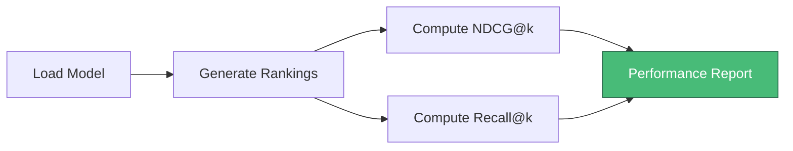

# Evaluation Code

This module provides comprehensive evaluation metrics for assessing the performance of trained ranking models.

## Contents

| File | Purpose |
|------|---------|
| `improvised_Evaluation_code.ipynb` | Jupyter notebook for model evaluation |

## Evaluation Metrics

The evaluation framework computes ranking quality using two primary metrics at multiple cutoff points:

### NDCG@k (Normalized Discounted Cumulative Gain)

Measures ranking quality by considering position-dependent relevance:

$$\text{NDCG@k} = \frac{DCG@k}{IDCG@k}$$

| k | Interpretation |
|---|----------------|
| 2 | Top-2 ranking precision |
| 5 | Top-5 ranking quality |
| 10 | Overall ranking coherence |

### Recall@k

Measures proportion of relevant items retrieved in top-k positions:

$$\text{Recall@k} = \frac{|\text{Relevant} \cap \text{Top-k}|}{|\text{Relevant}|}$$

## Notebook Workflow



## Usage

1. Open the notebook in Jupyter:
   ```bash
   jupyter notebook improvised_Evaluation_code.ipynb
   ```

2. Configure the model path:
   ```python
   LLAMA_MODEL_PATH = "/path/to/trained/model"
   ```

3. Execute all cells to generate evaluation metrics

## Output Format

The notebook produces:
- NDCG@k scores for k ∈ {2, 5, 10}
- Recall@k scores for k ∈ {2, 5, 10}
- Comparative analysis against baseline

## Human Evaluation Comparison

For validation against human judgments, see:
- [`../SUMMIR_example_response.md`](../SUMMIR_example_response.md): Sentences for human evaluation
- [`../response_human.csv`](../response_human.csv): Rankings from 30 human evaluators
