# Sports Insight Ranking Codebase - Analysis & Findings

## Quick Start

```bash
pip install torch transformers trl sentence-transformers spacy nltk faiss-cpu pandas scikit-learn openai summac && python -m spacy download en_core_web_sm && python -c "import nltk; nltk.download('vader_lexicon')"
```

---

## 🎯 Final Ranking Code

**`training_code/6_metrics_Training_code.py`** = Main SUMMIR framework (708 lines)

| Feature | Value |
|---------|-------|
| Model | Llama 3.2 3B + PPO |
| Metrics | Semantic, Sentiment, TF-IDF, Buzzword, Person, Sarcasm |
| Reward | 70% NDCG + 30% ScoreNet |

---

## ⚠️ Incomplete Files (3 Found)

| File | Issue | Location |
|------|-------|----------|
| `article_validation_save.py` | Missing validation loops | Lines 134-145 |
| `insight_generation.py` | Missing processing loop | Lines 127-129 |
| `improvised_Evaluation_code.ipynb` | 3 empty cells, no dataset loading | Cells 11, 12, 14 |

---

### 1. article_validation_save.py

**Problem**: Empty loops for processing pre-game and post-game articles.

<details>
<summary>📄 Current Code (Incomplete)</summary>

```python
    precnt = 0
    os.makedirs(f'{out_path}/{match_name}',exist_ok=True)
    
    # Loop processing and saving pre-game articles

    if precnt < TH:
        print("valid pre game count less than TH...",file=LOGGER)
        shutil.rmtree(f'{out_path}/{match_name}')
        continue
    
    postcnt = 0

    # Loop processing post-game articles

    if postcnt < TH:
```

</details>

<details>
<summary>✅ Expected Code (What Should Be There)</summary>

```python
    precnt = 0
    os.makedirs(f'{out_path}/{match_name}',exist_ok=True)
    
    # Loop processing and saving pre-game articles
    for file_name in before_files[:maxTH]:
        file_path = os.path.join(match_folder, file_name)
        with open(file_path, 'r', encoding='utf-8') as f:
            content = f.read()
        result = get_llm_output(content, match_name)
        if 'relevant' in result.lower():
            out_file_path = os.path.join(f'{out_path}/{match_name}', file_name)
            with open(out_file_path, 'w', encoding='utf-8') as f:
                f.write(content)
            precnt += 1
            print(f"Pre-game {file_name}: RELEVANT", file=LOGGER)
        else:
            print(f"Pre-game {file_name}: IRRELEVANT", file=LOGGER)
        LOGGER.flush()

    if precnt < TH:
        ...
    
    postcnt = 0

    # Loop processing post-game articles  
    for file_name in after_files[:maxTH]:
        file_path = os.path.join(match_folder, file_name)
        with open(file_path, 'r', encoding='utf-8') as f:
            content = f.read()
        result = get_llm_output(content, match_name)
        if 'relevant' in result.lower():
            out_file_path = os.path.join(f'{out_path}/{match_name}', file_name)
            with open(out_file_path, 'w', encoding='utf-8') as f:
                f.write(content)
            postcnt += 1
        LOGGER.flush()

    if postcnt < TH:
```

</details>

---

### 2. insight_generation.py

**Problem**: Missing the main loop that processes articles and saves insights.

<details>
<summary>📄 Current Code (Incomplete)</summary>

```python
total = 0
irrelevant = 0
jsonerror = 0

logger = open(f'../Logs/insights_log_{model_name}_{SPORTS[SPORT_INDEX]}.txt', 'a')

# Loop processing each articles and storing thiei insights
             
print(f"Total Files: {total}", file=logger)
print(f"Irrelevant Files: {irrelevant}", file=logger)
```

</details>

<details>
<summary>✅ Expected Code (What Should Be There)</summary>

```python
total = 0
irrelevant = 0
jsonerror = 0

logger = open(f'../Logs/insights_log_{model_name}_{SPORTS[SPORT_INDEX]}.txt', 'a')
os.makedirs(output_dir, exist_ok=True)

# Loop processing each articles and storing their insights
for match_name in os.listdir(input_dir):
    match_folder = os.path.join(input_dir, match_name)
    output_match_folder = os.path.join(output_dir, match_name)
    os.makedirs(output_match_folder, exist_ok=True)
    
    for file_name in os.listdir(match_folder):
        if not file_name.endswith('.txt'):
            continue
        total += 1
        file_path = os.path.join(match_folder, file_name)
        
        with open(file_path, 'r', encoding='utf-8') as f:
            content = f.read()
        
        response = get_llm_output(content, match_name, SPORT_INDEX)
        parsed_json, error = extract_json(response)
        
        if parsed_json is None:
            if "irrelevant" in str(error).lower():
                irrelevant += 1
            else:
                jsonerror += 1
            continue
        
        output_file = os.path.join(output_match_folder, file_name.replace('.txt', '.json'))
        with open(output_file, 'w', encoding='utf-8') as f:
            json.dump(parsed_json, f, indent=2)

print(f"Total Files: {total}", file=logger)
print(f"Irrelevant Files: {irrelevant}", file=logger)
```

</details>

---

### 3. improvised_Evaluation_code.ipynb

**Problems**:
- Cells 11, 12, 14 are completely empty
- Only 10 hardcoded test samples (no external dataset loading)
- Never uses `response_human.csv` for human comparison

<details>
<summary>📄 Current State</summary>

```python
# Cell 7 - Only 10 hardcoded samples:
data_points = [
    {"candidates": [...], "ranking": [...]},
    # ... only 10 samples
]

# Cells 11, 12, 14 are EMPTY
```

</details>

<details>
<summary>✅ Missing Dataset Loading Code</summary>

```python
import json

def load_evaluation_data(dataset_path):
    data_points = []
    with open(dataset_path, 'r', encoding='utf-8') as f:
        for line in f:
            item = json.loads(line.strip())
            if "candidates" in item and "ranking" in item:
                data_points.append(item)
    return data_points

data_points = load_evaluation_data("./Dataset/subDataset.jsonl")
print(f"Loaded {len(data_points)} samples")
```

</details>

<details>
<summary>✅ Missing Human Comparison Code</summary>

```python
import pandas as pd
from scipy.stats import kendalltau, spearmanr

human_rankings = pd.read_csv("response_human.csv")

def compare_with_human(model_ranking, human_ranking):
    tau, _ = kendalltau(model_ranking, human_ranking)
    rho, _ = spearmanr(model_ranking, human_ranking)
    return {"kendall_tau": tau, "spearman_rho": rho}
```

</details>

---

## 📊 Execution Workflow

```mermaid
flowchart LR
    subgraph P1["🔴 Phase 1: Data Generation"]
        direction TB
        A["❌ article_validation_save.py"] --> B["❌ insight_generation.py"]
        B --> C["✅ factScore.py"]
    end
    
    subgraph P2["🟢 Phase 2: Training"]
        direction TB
        D["Scorenet_model_Training_code.py"] --> E["⭐ 6_metrics_Training_code.py"]
    end
    
    subgraph P3["🟠 Phase 3: Evaluation"]
        F["⚠️ improvised_Evaluation_code.ipynb"]
    end
    
    P1 --> P2 --> P3
    
    style A fill:#ffcdd2,stroke:#c62828,color:#000
    style B fill:#ffcdd2,stroke:#c62828,color:#000
    style C fill:#c8e6c9,stroke:#2e7d32,color:#000
    style D fill:#e3f2fd,stroke:#1565c0,color:#000
    style E fill:#a5d6a7,stroke:#1b5e20,stroke-width:3px,color:#000
    style F fill:#fff3e0,stroke:#ef6c00,color:#000
```



---

## 📁 File Dependency Graph

```mermaid
flowchart TB
    subgraph Dataset["📂 Dataset"]
        DS[("🏏 Cricket | ⚾ MLB | 🏀 NBA | ⚽ Soccer")]
    end
    
    subgraph Supplementary["📂 Supplementary Files"]
        S1["📄 sports_keywords.csv"]
        S2["📄 processed_persons.csv"]
        S3["📄 sports_sentiment.csv"]
    end
    
    subgraph Training["📂 Training Code"]
        T1["🔧 Scorenet_model_Training_code.py"]
        T2["⭐ 6_metrics_Training_code.py"]
    end
    
    subgraph Ablation["📂 Ablation Models"]
        A1["Llama-3.2-3B-ndcg_only.py"]
        A2["Llama-3.2-3B-recall_only.py"]
    end
    
    subgraph Eval["📂 Evaluation"]
        E1["📓 improvised_Evaluation_code.ipynb"]
    end
    
    DS --> T1 & T2 & A1 & A2
    S1 & S2 & S3 --> T2
    T1 --> T2
    T2 --> E1
    
    style DS fill:#e1bee7,stroke:#7b1fa2,color:#000
    style T2 fill:#a5d6a7,stroke:#1b5e20,stroke-width:3px,color:#000
    style S1 fill:#fff9c4,stroke:#f9a825,color:#000
    style S2 fill:#fff9c4,stroke:#f9a825,color:#000
    style S3 fill:#fff9c4,stroke:#f9a825,color:#000
    style E1 fill:#ffe0b2,stroke:#ef6c00,color:#000
```



---

## 📁 File Reference

### Training Code

| File | Purpose | Status |
|------|---------|--------|
| `6_metrics_Training_code.py` | **SUMMIR (Final)** | ✅ Complete |
| `Scorenet_model_Training_code.py` | Pre-train ScoreNet | ✅ Complete |
| `Llama-3.2-3B-ndcg_only.py` | Ablation (NDCG) | ✅ Complete |
| `Llama-3.2-3B-recall_only.py` | Ablation (Recall) | ✅ Complete |
| `Llama-3.2-1B-ndcg_only.py` | Small model NDCG | ✅ Complete |
| `Llama-3.2-1B-recall_only.py` | Small model Recall | ✅ Complete |

### Data Generation

| File | Purpose | Status |
|------|---------|--------|
| `article_validation_save.py` | Validate articles | ❌ Incomplete |
| `insight_generation.py` | Generate insights | ❌ Incomplete |
| `factScore.py` | GPT-4o fact scoring | ✅ Complete |
| `summacConv.py` | SummaCConv scoring | ✅ Complete |

### Supplementary Files

| File | Purpose |
|------|---------|
| `sports_keywords.csv` | Buzzword scoring |
| `processed_persons.csv` | Famous people HPI |
| `sports_sentiment.csv` | Sentiment analysis |

---

## 🏗️ SUMMIR Architecture

```mermaid
flowchart TB
    Input["📝 Input Sentence"]
    
    subgraph Features["🔬 6 Feature Extractors"]
        direction LR
        F1["🔤 Semantic<br/><i>BERT embeddings</i>"]
        F2["😊 Sentiment<br/><i>NLTK VADER</i>"]
        F3["📊 TF-IDF<br/><i>sklearn</i>"]
        F4["🔥 Buzzword<br/><i>keywords.csv</i>"]
        F5["👤 Person<br/><i>HPI score</i>"]
        F6["😏 Sarcasm<br/><i>classifier</i>"]
    end
    
    ScoreNet["🧠 ScoreNet<br/><b>softmax weights</b>"]
    
    subgraph Reward["🎯 PPO Reward"]
        direction LR
        R1["📈 NDCG_gold × 0.7<br/><i>Ground Truth</i>"]
        R2["📉 NDCG_scorenet × 0.3<br/><i>ScoreNet Prediction</i>"]
    end
    
    Output["📊 Ranked Output"]
    
    Input --> Features
    F1 & F2 & F3 & F4 & F5 & F6 --> ScoreNet
    ScoreNet --> Reward
    R1 & R2 --> Output
    
    style Input fill:#e3f2fd,stroke:#1565c0,color:#000
    style ScoreNet fill:#a5d6a7,stroke:#1b5e20,stroke-width:3px,color:#000
    style Output fill:#bbdefb,stroke:#1976d2,stroke-width:2px,color:#000
    style F1 fill:#f3e5f5,stroke:#7b1fa2,color:#000
    style F2 fill:#f3e5f5,stroke:#7b1fa2,color:#000
    style F3 fill:#f3e5f5,stroke:#7b1fa2,color:#000
    style F4 fill:#f3e5f5,stroke:#7b1fa2,color:#000
    style F5 fill:#f3e5f5,stroke:#7b1fa2,color:#000
    style F6 fill:#f3e5f5,stroke:#7b1fa2,color:#000
    style R1 fill:#fff9c4,stroke:#f9a825,color:#000
    style R2 fill:#fff9c4,stroke:#f9a825,color:#000
```



---

## ✅ Summary

| Item | Value |
|------|-------|
| **Final Code** | `6_metrics_Training_code.py` |
| **Incomplete Files** | 3 |
| **Training Order** | ScoreNet → SUMMIR |
| **Metrics** | NDCG@k, Recall@k (k=2,5,10) |

### Action Items

1. ❌ Fix `article_validation_save.py` - add validation loops
2. ❌ Fix `insight_generation.py` - add processing loop  
3. ❌ Fix `improvised_Evaluation_code.ipynb` - add dataset loading
4. ✅ Run ScoreNet training first
5. ✅ Then run 6_metrics training
