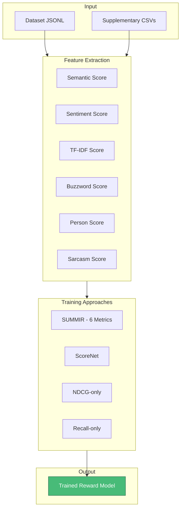

# Training Code

This module implements the reward model training framework for the SUMMIR (Sentence Unified Multimetric Model for Importance Ranking) system using Proximal Policy Optimization (PPO).

## Architecture Overview



## Training Scripts

### SUMMIR Framework (Primary)

**File:** `6_metrics_Training_code.py`

| Attribute | Value |
|-----------|-------|
| **Framework** | PPO (Proximal Policy Optimization) |
| **Base Model** | Llama 3.2 (1B/3B) |
| **Metrics** | 6 custom feature scores |
| **Loss** | NDCG-based ranking loss |

**Six Feature Metrics:**
1. **Semantic Score**: Verb similarity via SentenceTransformer
2. **Sentiment Score**: VADER sentiment analysis
3. **TF-IDF Score**: Term frequency relevance
4. **Buzzword Score**: Sports keyword matching
5. **Person Score**: Named entity importance (HPI)
6. **Sarcasm Score**: T5-based sarcasm detection

---

### ScoreNet Training

**File:** `Scorenet_model_Training_code.py`

| Attribute | Value |
|-----------|-------|
| **Architecture** | Lightweight neural scorer |
| **Loss** | ListNet ranking loss |
| **Purpose** | Learn optimal feature weights |

---

### Single-Metric Training

| File | Model Size | Optimization Target |
|------|------------|---------------------|
| `Llama-3.2-1B-ndcg_only.py` | 1B params | NDCG maximization |
| `Llama-3.2-1B-recall_only.py` | 1B params | Recall maximization |
| `Llama-3.2-3B-ndcg_only.py` | 3B params | NDCG maximization |
| `Llama-3.2-3B-recall_only.py` | 3B params | Recall maximization |

## Usage

```bash
# Train SUMMIR model (recommended)
python 6_metrics_Training_code.py

# Train ScoreNet weights
python Scorenet_model_Training_code.py

# Train single-metric models
python Llama-3.2-3B-ndcg_only.py
```

## Training Visualizations

The [`images_while_training/`](images_while_training/) directory contains pre/post training reward distribution plots:

| Image | Description |
|-------|-------------|
| `*-pre-values-*.jpg` | Reward distributions before training |
| `*-post-values-*.jpg` | Reward distributions after training |

## Dependencies

```python
torch, transformers, trl, sentence-transformers
spacy, nltk, faiss-cpu, sklearn
```

## Related Files

- Feature data: [`../supplementary_files/`](../supplementary_files/)
- Evaluation: [`../evaluation_code/`](../evaluation_code/)
