# SUMMIR - Sports Insight Ranking Framework

> A comprehensive guide to understanding the codebase architecture and workflow.

## Quick Start

```bash
pip install torch transformers trl sentence-transformers spacy nltk faiss-cpu pandas scikit-learn openai summac && python -m spacy download en_core_web_sm && python -c "import nltk; nltk.download('vader_lexicon')"
```

---

## 🏗️ How SUMMIR Works

The SUMMIR framework uses **6 feature extractors** combined with a neural network (ScoreNet) and reinforcement learning (PPO) to rank sports insights.

```mermaid
flowchart TB
    Input["📝 Input Sentence"]
    
    subgraph Features["🔬 6 Feature Extractors"]
        direction LR
        F1["🔤 Semantic<br/><i>BERT embeddings</i>"]
        F2["😊 Sentiment<br/><i>NLTK VADER</i>"]
        F3["📊 TF-IDF<br/><i>sklearn</i>"]
        F4["🔥 Buzzword<br/><i>keywords.csv</i>"]
        F5["👤 Person<br/><i>HPI score</i>"]
        F6["😏 Sarcasm<br/><i>classifier</i>"]
    end
    
    ScoreNet["🧠 ScoreNet<br/><b>softmax weights</b>"]
    
    subgraph Reward["🎯 PPO Reward"]
        direction LR
        R1["📈 NDCG_gold × 0.7<br/><i>Ground Truth</i>"]
        R2["📉 NDCG_scorenet × 0.3<br/><i>ScoreNet Prediction</i>"]
    end
    
    Output["📊 Ranked Output"]
    
    Input --> Features
    F1 & F2 & F3 & F4 & F5 & F6 --> ScoreNet
    ScoreNet --> Reward
    R1 & R2 --> Output
    
    style Input fill:#e3f2fd,stroke:#1565c0,color:#000
    style ScoreNet fill:#a5d6a7,stroke:#1b5e20,stroke-width:3px,color:#000
    style Output fill:#bbdefb,stroke:#1976d2,stroke-width:2px,color:#000
    style F1 fill:#f3e5f5,stroke:#7b1fa2,color:#000
    style F2 fill:#f3e5f5,stroke:#7b1fa2,color:#000
    style F3 fill:#f3e5f5,stroke:#7b1fa2,color:#000
    style F4 fill:#f3e5f5,stroke:#7b1fa2,color:#000
    style F5 fill:#f3e5f5,stroke:#7b1fa2,color:#000
    style F6 fill:#f3e5f5,stroke:#7b1fa2,color:#000
    style R1 fill:#fff9c4,stroke:#f9a825,color:#000
    style R2 fill:#fff9c4,stroke:#f9a825,color:#000
```



### Feature Breakdown

| Feature | Method | Description |
|---------|--------|-------------|
| **Semantic** | BERT embeddings | Captures contextual meaning of text |
| **Sentiment** | NLTK VADER | Detects positive/negative tone |
| **TF-IDF** | sklearn | Measures term importance |
| **Buzzword** | keywords.csv | Scores sports-specific keywords |
| **Person** | HPI score | Weights famous personalities |
| **Sarcasm** | Classifier | Detects sarcastic statements |

---

## 📊 Execution Pipeline

The framework follows a three-phase execution pipeline from data generation to evaluation.


### Phase Details

| Phase | Purpose | Key Files |
|-------|---------|-----------|
| **Data Generation** | Validate articles, extract insights, compute fact scores | `article_validation_save.py`, `insight_generation.py`, `factScore.py` |
| **Training** | Train ScoreNet first, then train SUMMIR with PPO | `Scorenet_model_Training_code.py`, `6_metrics_Training_code.py` |
| **Evaluation** | Evaluate model performance with NDCG and Recall metrics | `improvised_Evaluation_code.ipynb` |

---

## 📁 File Dependency Graph

This diagram shows how different components of the codebase interact with each other.

```mermaid
flowchart TB
    subgraph Dataset["📂 Dataset"]
        DS[("🏏 Cricket | ⚾ MLB | 🏀 NBA | ⚽ Soccer")]
    end
    
    subgraph Supplementary["📂 Supplementary Files"]
        S1["📄 sports_keywords.csv"]
        S2["📄 processed_persons.csv"]
        S3["📄 sports_sentiment.csv"]
    end
    
    subgraph Training["📂 Training Code"]
        T1["🔧 Scorenet_model_Training_code.py"]
        T2["⭐ 6_metrics_Training_code.py"]
    end
    
    subgraph Ablation["📂 Ablation Models"]
        A1["Llama-3.2-3B-ndcg_only.py"]
        A2["Llama-3.2-3B-recall_only.py"]
    end
    
    subgraph Eval["📂 Evaluation"]
        E1["📓 improvised_Evaluation_code.ipynb"]
    end
    
    DS --> T1 & T2 & A1 & A2
    S1 & S2 & S3 --> T2
    T1 --> T2
    T2 --> E1
    
    style DS fill:#e1bee7,stroke:#7b1fa2,color:#000
    style T2 fill:#a5d6a7,stroke:#1b5e20,stroke-width:3px,color:#000
    style S1 fill:#fff9c4,stroke:#f9a825,color:#000
    style S2 fill:#fff9c4,stroke:#f9a825,color:#000
    style S3 fill:#fff9c4,stroke:#f9a825,color:#000
    style E1 fill:#ffe0b2,stroke:#ef6c00,color:#000
```



---

## 🎯 Core Training Code

**`training_code/6_metrics_Training_code.py`** is the main SUMMIR framework (708 lines).

| Feature | Value |
|---------|-------|
| **Model** | Llama 3.2 3B + PPO |
| **Metrics** | Semantic, Sentiment, TF-IDF, Buzzword, Person, Sarcasm |
| **Reward** | 70% NDCG + 30% ScoreNet |

---

## 📁 File Reference

### Training Code

| File | Purpose |
|------|---------|
| `6_metrics_Training_code.py` | **SUMMIR (Main Framework)** |
| `Scorenet_model_Training_code.py` | Pre-train ScoreNet model |
| `Llama-3.2-3B-ndcg_only.py` | Ablation study (NDCG only) |
| `Llama-3.2-3B-recall_only.py` | Ablation study (Recall only) |
| `Llama-3.2-1B-ndcg_only.py` | Small model variant (NDCG) |
| `Llama-3.2-1B-recall_only.py` | Small model variant (Recall) |

### Data Generation

| File | Purpose |
|------|---------|
| `article_validation_save.py` | Validate and filter relevant articles |
| `insight_generation.py` | Extract insights from articles |
| `factScore.py` | GPT-4o based fact scoring |
| `summacConv.py` | SummaCConv consistency scoring |

### Supplementary Files

| File | Purpose |
|------|---------|
| `sports_keywords.csv` | Buzzword scoring dictionary |
| `processed_persons.csv` | Famous people HPI scores |
| `sports_sentiment.csv` | Sentiment analysis vocabulary |

---

## 📈 Evaluation Metrics

The framework uses the following metrics for evaluation:

| Metric | Values |
|--------|--------|
| **NDCG** | @k where k = 2, 5, 10 |
| **Recall** | @k where k = 2, 5, 10 |

---

## 🚀 Training Order

```
1. Train ScoreNet → Scorenet_model_Training_code.py
2. Train SUMMIR  → 6_metrics_Training_code.py
3. Evaluate      → improvised_Evaluation_code.ipynb
```
